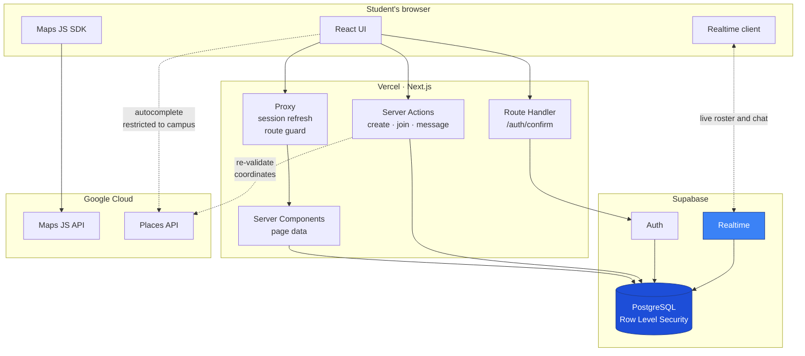
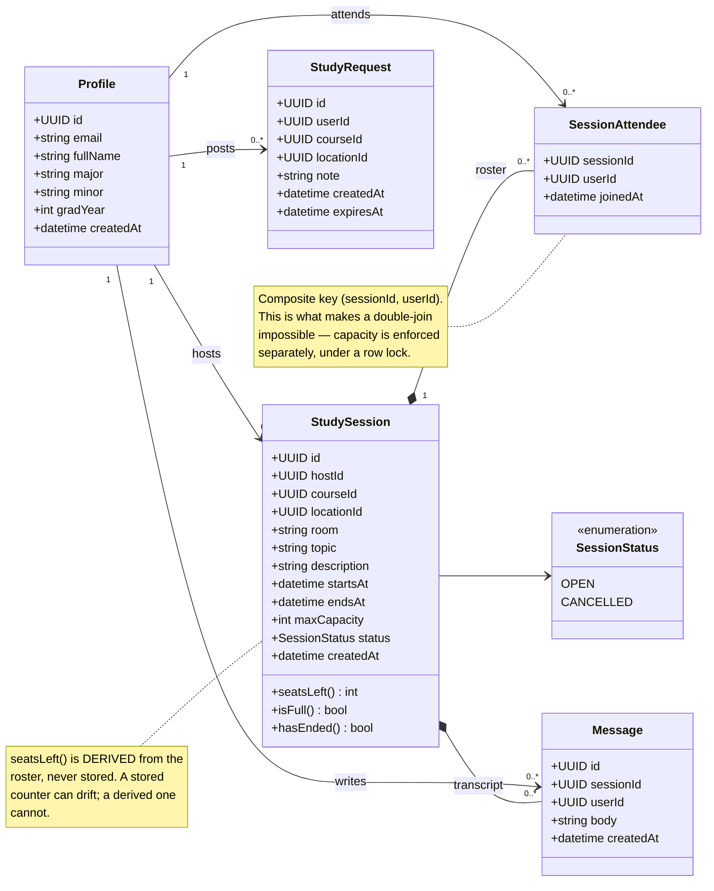
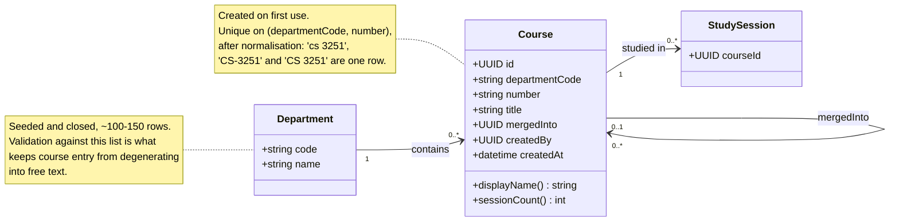
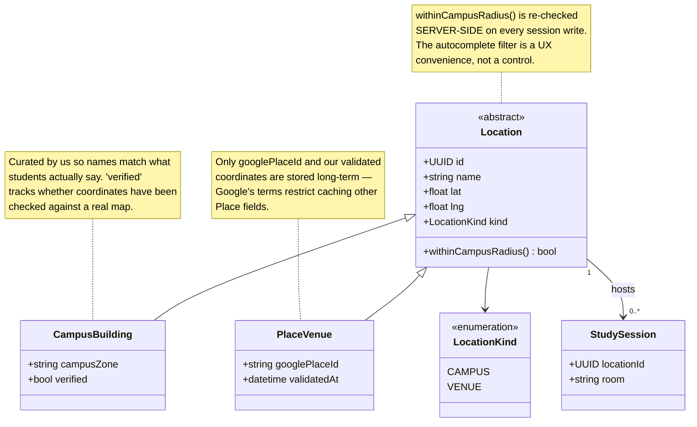
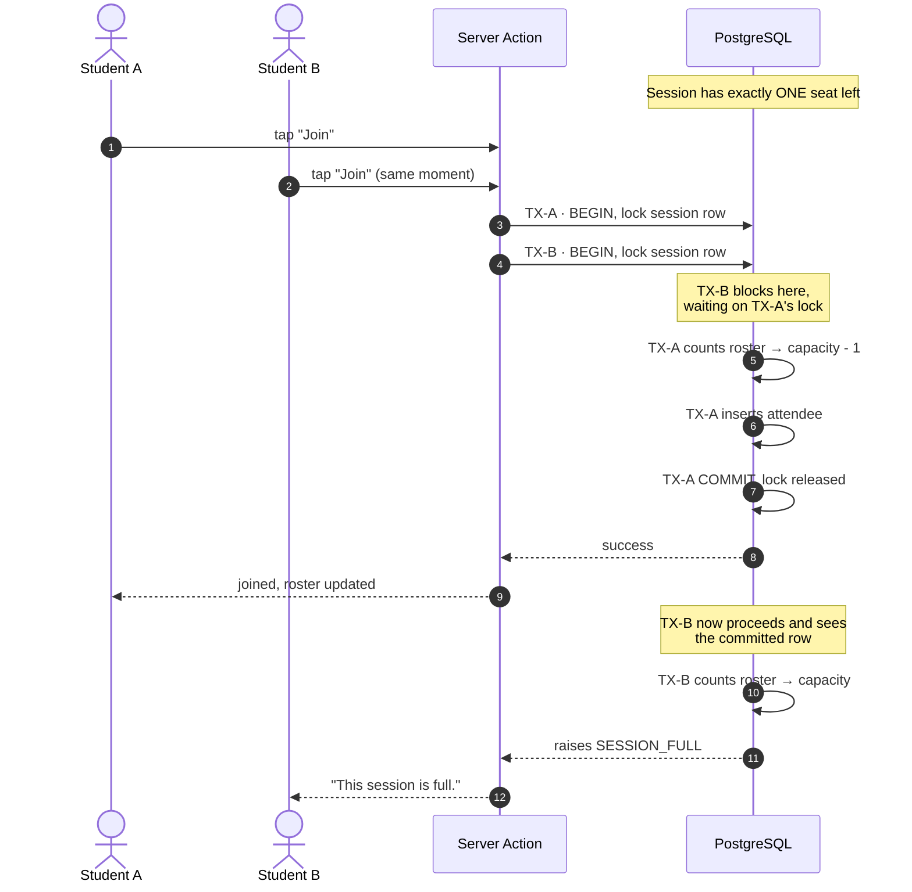

# Architecture

> **Schema status:** the class models below are **proposed**, not agreed. They
> exist to give TASK-00 (the schema discussion) something concrete to argue
> with. Treat every attribute as a suggestion until the team has walked through
> them together.
>
> The runtime architecture is settled — see [ADR 0001](./adr/0001-stack.md)
> (stack), [0003](./adr/0003-authentication.md) (auth), and
> [0007](./adr/0007-map-provider.md) (maps).

---

## 1. The shape of the system

Study Buddy is **one deployable**, not a client and a server. The original plan
in the Requirements Analysis Report called for a React frontend on Vercel and a
separate Node/Express or FastAPI service on Render. We collapsed that into a
single Next.js application and moved the responsibilities a backend service
would normally hold into two places:

- **Next.js server code** — Server Components, Server Actions, and Route
  Handlers, running on Vercel. This is where writes are validated and where
  anything requiring a secret happens.
- **PostgreSQL itself** — hosted by Supabase, with Row Level Security policies
  that decide who may read or write each row.

The reasoning is in ADR 0001. The short version: with four people and twelve
weeks, the cost of a second deployable — second repo, second deploy, CORS, a
split where half the team can't read the other half's code — was larger than
any benefit it bought at our scale.

### The architecturally interesting part

Most three-tier applications route every database interaction through the
application server. **We do not.** There are two paths to the data:

| Path | Used for | Guarded by |
| --- | --- | --- |
| Browser → Next.js server → Postgres | Writes, sensitive reads, anything needing a secret | Server-side validation **and** RLS |
| Browser → Supabase → Postgres | Realtime subscriptions, live roster and chat updates | RLS only |

The second path is what replaces the Socket.IO server from the original plan.
The browser holds a direct WebSocket to Supabase and receives row changes as
they happen — no socket server of ours to write, deploy, or keep alive.

**The consequence is that Row Level Security is load-bearing.** On the realtime
path there is no application code between the client and the data; the policy
*is* the access control. A mistake in a policy is not a bug that shows the
wrong UI, it is a data breach. This is the central tradeoff of the
architecture, and it is worth saying out loud rather than discovering in
Sprint 4.

Two practices follow from it, and both belong in the schema discussion:

1. **Deny by default.** Enable RLS on every table at creation, then add
   policies. A table with RLS enabled and no policy is inaccessible, which is
   the correct failure direction.
2. **Row-level is not column-level.** A policy that makes a row readable makes
   *every column* of it readable. Hiding a single field — an email address,
   say — needs a separate mechanism. This has already caught us once; see
   US-25.

### Container diagram

Note the two arrows reaching the data: one through Vercel, one straight from
the browser. Both terminate at the same policies.

### Where each concern is enforced

A recurring theme, and the thing to internalise before writing code:

| Concern | Convenience check | Actual enforcement |
| --- | --- | --- |
| Vanderbilt-only signup | Form validation | Database trigger on user creation |
| Session field validity | Zod schema in `lib/validation.ts` | `CHECK` constraints |
| Capacity limits | Disabled Join button | Row lock inside the join routine |
| Chat visibility | Not rendering the chat | RLS policy on messages |
| Location within campus radius | `locationRestriction` on autocomplete | Server-side coordinate re-check |

The left column produces good error messages. The right column is what is
actually true. Never let the left column be the only one.

---

## 2. Class models

Three views, split so each stays readable. Together they are the proposed
domain model.

### 2.1 Session domain

The core of the product: who is meeting, where, and what they say to each
other.

**Two decisions embedded here that deserve discussion:**

- `SessionAttendee` is a composite-keyed association, not an entity with its own
  id. That composite key is a correctness mechanism, not a modelling detail — it
  is what makes joining twice impossible at the database level rather than in
  application logic.
- `seatsLeft()` is a derived operation. The alternative — an `attendeeCount`
  column — is faster to read and will eventually disagree with the roster.
  Given the whole product promises accurate seat counts, derived is the safer
  default at our scale. **This is a genuine tradeoff; argue it in TASK-00.**

The host is expected to appear on their own roster, so seat maths and chat
membership treat them like any other attendee.

### 2.2 Course taxonomy

Implements [ADR 0006](./adr/0006-course-model.md): the department list is a
closed seeded set, course numbers are learned from use.

The self-reference on `mergedInto` exists from day one so duplicate or
mistyped courses can be collapsed later without a migration. **Do not build a
merge UI now** — the column alone is enough until the data actually degrades.

### 2.3 Location hierarchy

Implements [ADR 0007](./adr/0007-map-provider.md): curated campus buildings and
Google-sourced nearby venues are different things with a shared interface.

`room` belongs on the session, not the location — one building hosts many
sessions in many rooms.

**Implementation question for TASK-00:** single table with a `kind`
discriminator, or table-per-subclass? Single-table is simpler and makes the
foreign key from `StudySession` trivial; table-per-type is cleaner but forces
either two nullable FKs or a polymorphic reference. At our scale, single-table
with a discriminator is probably right — but decide it deliberately.

---

## 3. The join sequence

Worth its own diagram, because it is the one piece of behaviour that is
genuinely hard to get right and impossible to verify by clicking around.

The lock is the entire mechanism. Without it both transactions read the same
stale count, both decide a seat is free, and the session ends up
oversubscribed — the classic read-then-write race.

Two things follow:

- **Joining must not be a plain `INSERT` from application code.** The count and
  the insert have to happen inside one transaction holding the lock. In
  practice that means a database function, with the insert permission withheld
  from clients so the function is the only way in.
- **This is testable without a browser.** Two database connections and a
  transaction reproduce it deterministically. See `US-07b` in
  [`test-cases.md`](./test-cases.md) — it is the first test worth writing once
  the schema exists.

### A note on how this was framed

The Requirements Analysis Report called this race "the single most serious
challenge in delivering the product on schedule." We think that overstates it:
at 10–15 users the collision is vanishingly rare, and the mitigation is about
twenty lines of PL/pgSQL. It is a correctness requirement, not a schedule risk.

The risks that could actually cost the semester are in
[ADR 0005](./adr/0005-ci-in-sprint-one.md). Worth correcting in the report —
"we identified the race, closed it in twenty lines, and here is what actually
threatened the timeline" is a stronger engineering narrative than the original.

---

## 4. Request lifecycles

How the pieces fit together for the three flows that matter.

**Signing in (US-01).** Student submits a Vanderbilt address → server action
validates the domain and asks Supabase Auth to email a one-time link → student
opens the link → `/auth/confirm` exchanges the token for a session cookie →
proxy refreshes that cookie on every subsequent request. The domain restriction
is enforced by a database trigger, so calling the auth API directly does not
bypass it.

**Browsing sessions (US-03, US-06, US-12).** A Server Component loads open,
not-yet-ended sessions with their seat counts and renders on the server.
Filtering by course and campus zone happens client-side over the loaded set —
fine at our scale, and it avoids a round trip per keystroke. The map is loaded
client-side only, since the Maps SDK needs a browser.

**Joining and chatting (US-04, US-05).** Join goes through the server action
and the locked database function above. Once on the roster, the browser
subscribes directly to Supabase Realtime for that session's roster and
messages. Chat visibility is enforced by policy, not by the client choosing not
to render — a non-attendee subscribing to the channel directly receives
nothing.

---

## 5. What this architecture is bad at

Stated plainly, because every architecture document that only lists strengths
is marketing.

- **RLS policies are a single point of failure.** They are the only thing
  standing between a subscribed browser and the data. They are also easy to get
  subtly wrong, and the failure mode is silent.
- **Vendor coupling.** Auth and realtime are Supabase-shaped; migrating away
  means rewriting both. The PostgreSQL underneath stays portable, which is the
  part that matters most.
- **Client-side filtering does not scale.** Loading every open session and
  filtering in the browser is right for 10–15 users and wrong for 10,000. It is
  a deliberate, reversible shortcut — not an oversight.
- **Venue data has a runtime dependency on Google.** We store a `place_id` and
  validated coordinates but not full details, so venue display degrades if
  Google is unavailable or the billing account lapses.
- **No offline story.** The app assumes connectivity. For a campus app used
  while walking between buildings, that is an assumption worth revisiting if
  users complain.
