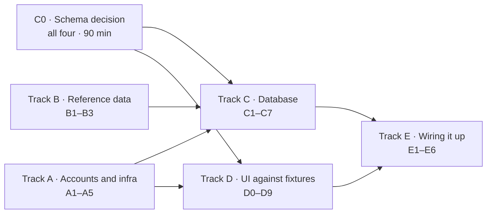

# Sprint tickets

Smaller than the user stories in [`backlog.md`](./backlog.md) — each of these is
one person, one sitting. Story and task IDs carry through so traceability
survives: name the branch after the first ID on the ticket
(`us-04-atomic-join`, `task-03-supabase-project`).

**Sizes:** S ≈ 1–2h · M ≈ 3–4h · L ≈ 5–6h. These are guesses with no
velocity behind them — re-size after the first sprint.

## How this is structured

The schema blocks most feature work, so the tracks are arranged so that as
little as possible waits on it.

| Can start today | Waits on C0 |
| --- | --- |
| All of Track A · all of Track B · T-D1, T-D2 | Track C · T-D0 and the Track D tickets that use fixtures |

The arrows are track-level. The real edges are narrower: A5 (local
database) is what Track C needs, A2 (map keys) is what D5 and D6 need, and B1
and B2 feed only the seed in C6. Each ticket lists its own dependencies.

**Do C0 first.** It is a meeting, not a ticket, and Track C cannot start until
it happens. Bring `docs/architecture.md` §2 — the proposed class models are
there to be argued with.

---

## C0 · Schema decision meeting

**All four · 90 minutes · TASK-00 · blocks Track C and T-D0**

Decide and write down:

- Final table list and relationships
- Seat count: derived from the roster, or a stored counter
- How concurrent joins stay correct
- Authorization: RLS policies, application checks, or both
- Locations: single table with a `kind` discriminator, or table-per-subclass
- **How a venue row gets written.** Clients must not insert locations directly,
  or the campus-radius check is skippable. Server action, or a database
  function that checks the radius itself? If the latter, the radius now lives
  in two places (SQL and `src/lib/env.ts`) that must agree.
- **Display name.** Magic-link sign-in collects only an email, but the roster
  needs a name. Required at first sign-in, or optional with a fallback?
- **Study requests (US-16):** what they reference (course? location?) and when
  they expire.

**Done when:**
- [ ] `docs/architecture.md` §2 updated from "Proposed" to "Agreed"
- [ ] The decisions recorded as ADR 0008, including what was rejected
- [ ] `supabase/README.md` "Before writing the first migration" list updated
- [ ] Track C tickets edited to name concrete tables

---

## Track A · Accounts and infrastructure

No dependencies. Somebody should pick these up on day one.

### T-A1 · Create the hosted Supabase project
**S · TASK-03 · blocks E1–E6 on the deployed app**
- [ ] Project created, region chosen
- [ ] URL and anon key added to every member's `.env.local` and to Vercel
- [ ] The **service-role key and database password** kept out of the repo and
      out of any `NEXT_PUBLIC_` variable, and shared through something that is
      not Slack or email

> The anon key is not a secret — it ships to the browser and RLS is what
> guards the data. The service-role key bypasses RLS entirely. That is the one
> to protect.

### T-A2 · Google Cloud project and API keys
**M · TASK-06 · ADR 0007 · depends on A4 · blocks D5, D6**
- [ ] Project created, billing account attached, owner agreed by the team
- [ ] Maps JavaScript API and Places API enabled
- [ ] Browser key created and **restricted by HTTP referrer** (Vercel domain + localhost) and by API
- [ ] Server key created and **restricted by IP**
- [ ] Both added to `.env.local` and Vercel
- [ ] Budget alert set
- [ ] Current pricing and free-tier limits checked against Google's own pages
      and noted in ADR 0007 — nothing in the repo has verified them

> Do not commit either key. The A4 dependency is deliberate: push protection
> is the only safety net against a key landing in a public repo.

### T-A3 · Deploy the scaffold to Vercel
**S**
- [ ] Repo connected, `main` deploys automatically
- [ ] Preview deployments enabled for pull requests
- [ ] Deployed URL in the README

### T-A4 · Repository protections
**S · blocks A2**
- [ ] Secret scanning and push protection enabled
- [ ] `main` ruleset: PR required, `verify` check required, no force push, no deletion
- [ ] Dependabot config for npm and GitHub Actions
- [ ] `permissions: contents: read` added to `ci.yml`

### T-A5 · Local database and database test harness
**M · TASK-03 · blocks C1–C7 · US-07b**
- [x] `supabase init` run and `supabase/config.toml` committed
- [x] `supabase start` + `supabase db reset` documented in the README, including the Docker requirement
- [x] A way to run tests against the local database with **two independent
      connections** — pgTAP via `supabase test db`, or Vitest with two `pg`
      clients. Pick one and write down why. *(Vitest + `pg`; reasoning in
      `test-cases.md` under US-07b.)*
- [x] One trivial database test passing, to prove the harness works
- [x] Decision recorded: do database tests run in CI (`supabase start` in
      Actions) or locally only? If locally only, say so in `test-cases.md`
      *(CI — the `db` job.)*

> Track C is developed and tested against this local database, not the hosted
> project. That is why A1 blocks the deployed app rather than the migrations.

---

## Track B · Reference data

No dependencies. Pure data work — a good ticket for whoever wants to start
without touching the stack.

### T-B1 · Compile the department list
**M · TASK-02 · ADR 0006**
- [ ] `data/departments.json` with every subject code and full name
- [ ] Codes uppercase and trimmed
- [ ] Source noted in the file so it can be refreshed later
- [ ] Course-number format checked against the catalog across schools (four
      digits? letter suffixes?) and written into ADR 0006 — T-C2's regex
      depends on it

### T-B2 · Curate campus buildings
**M · TASK-01 · ADR 0007**
- [ ] `data/buildings.json`, ~25 core academic buildings
- [ ] Coordinates **checked against a real map**, not estimated
- [ ] Names match what students actually say
- [ ] A `campus_zone` on every row, from a short agreed list — US-12 filters on it
- [ ] `verified: true` only on rows genuinely checked
- [ ] `CAMPUS_CENTER` in `src/lib/env.ts` confirmed against the same map

### T-B3 · Ask VU about campus GIS data
**S · TASK-07**
- [ ] Email Facilities or VU IT asking whether campus building GIS data is available
- [ ] Reply recorded in the ticket

> Non-blocking. Send it and carry on with T-B2 — do not wait for an answer.

---

## Track C · Database

Blocked on C0 and T-A5. C1, C2, and C3 are independent of each other and can
run in parallel across three people; C4 needs all three.

Every table gets RLS enabled in the same migration that creates it — deny by
default, then add policies. See `docs/architecture.md` §1.

### T-C1 · Profiles, signup trigger, RLS
**M · US-01, US-25**
- [ ] `profiles` table, with a display name per the C0 decision
- [ ] Trigger rejecting non-`@vanderbilt.edu` signups
- [ ] Trigger creating a profile row on signup
- [ ] RLS enabled with read and self-update policies
- [ ] Email address not readable by other users — **a column-scoped `GRANT`**,
      because RLS cannot hide a column
- [ ] Database tests for US-01b (direct non-Vanderbilt signup rejected) and
      US-11b (another user's `email` denied)

### T-C2 · Departments and courses
**M · US-02, ADR 0006 · depends on B1 for the number format**
- [ ] `departments` and `courses` tables, unique on (department, number)
- [ ] Normalization applied on write
- [ ] `merged_into` column present
- [ ] RLS: any signed-in user may read; course creation allowed, department creation not
- [ ] Matching normalization and number rules in `src/lib/validation.ts`, unit tested

### T-C3 · Locations
**M · US-02, ADR 0007**
- [ ] `locations` table per the C0 decision, including `campus_zone`
- [ ] Campus radius check available server-side, reading the one constant in `src/lib/env.ts`
- [ ] RLS: read for signed-in users; **no direct client insert** — venue rows
      are written the way C0 decided

### T-C4 · Sessions, attendees, messages
**L · US-02, US-04, US-05 · depends on C1, C2, C3**
- [ ] Three tables with foreign keys and CHECK constraints (end after start,
      capacity bounds) mirrored in `src/lib/validation.ts`
- [ ] Attendee composite primary key
- [ ] RLS: sessions readable by all signed-in users; messages readable only by attendees
- [ ] **No INSERT permission on attendees** — that is C5's job
- [ ] Attendees and messages added to the Realtime publication (E4 and E5 need it)
- [ ] Database test for US-05b (non-attendee reads no messages)

### T-C5 · Atomic join
**M · US-04, US-07 · depends on C4**
- [ ] Join function holding a row lock across the capacity check and insert
- [ ] Distinct error codes for full, cancelled, ended, not-signed-in, each
      mapped to a message in `src/lib/errors.ts` and unit tested
- [ ] Host added to their own roster on session creation
- [ ] **Concurrency test from `test-cases.md` US-07b, passing**

> The test is the deliverable here, not the function. Two connections, one
> seat, exactly one winner.

### T-C6 · Generated types and seed loading
**S · TASK-05 · depends on C1–C4, B1, B2**
- [ ] TypeScript types generated from the schema, replacing hand-written ones
- [ ] `supabase/seed.sql` (or a seed script) loading `data/*.json`
- [ ] `supabase db reset` loads the seed; documented in the README
- [ ] Seed-freshness check added to CI — `CLAUDE.md` and ADR 0005 both
      describe it, but `ci.yml` does not run one yet

### T-C7 · Study requests
**S · US-16 · depends on C2, C3**
- [ ] `study_requests` table per the C0 decision, with an expiry
- [ ] RLS: signed-in users read; users insert and delete only their own
- [ ] Expired requests excluded from reads

---

## Track D · Interface

T-D1 and T-D2 can start today. Everything that renders data waits on T-D0,
which waits only on C0 (so the fixture shapes are right) — **not** on the
database. This is where two people can work productively while the schema
lands.

### T-D0 · Typed fixtures
**S · depends on C0 · unblocks the rest of Track D**
- [ ] Fixture data matching the agreed model — a handful of sessions, courses,
      locations, profiles, and study requests, including one full session and
      one with no attendees
- [ ] Exported from one module so every component imports the same shapes

### T-D1 · App shell
**M · ADR 0004**
- [ ] Header with navigation and a sign-in/out affordance
- [ ] Mobile-first container, 44px tap targets
- [ ] Loading and error states that are not blank screens

### T-D2 · Sign-in screen
**M · US-01**
- [ ] Email field, inline validation, `@vanderbilt.edu` message, using the
      shared rule in `src/lib/validation.ts` with unit tests
- [ ] "Check your inbox" confirmation state
- [ ] First-sign-in display-name step, if C0 made it required
- [ ] No backend — form submission stubbed

### T-D3 · Session list and card
**M · US-03, US-23 · depends on D0**
- [ ] Card showing course, topic, location, time, seats left
- [ ] Who is attending visible from the card (US-23), not only the session page
- [ ] Distinct "Full" treatment
- [ ] Empty state that invites hosting or posting a request (US-16)

### T-D4 · Filters
**M · US-06, US-12 · depends on D3**
- [ ] Course and campus-zone filters
- [ ] Clearing restores the full list
- [ ] Filter state does not reset on view toggle
- [ ] Component test for the US-06 / US-12 case in `test-cases.md`

### T-D5 · Map view
**M · US-03 · depends on A2, D0**
- [ ] Google Map centred on campus
- [ ] One marker per fixture session, distinct when full
- [ ] Info window with a link through to the session
- [ ] Loads client-side only

### T-D6 · Location picker
**L · US-02 · depends on A2**
- [ ] Campus building selector
- [ ] Places autocomplete using **`locationRestriction`**, not `locationBias`,
      built from `CAMPUS_CENTER` and `CAMPUS_RADIUS_METERS`
- [ ] `includedPrimaryTypes` set so residences are excluded
- [ ] Session tokens used

### T-D7 · Create-session form
**M · US-02 · depends on D6**
- [ ] Department picker plus course-number input with typeahead
- [ ] "Nobody's studied this yet — create it?" for unseen numbers
- [ ] Time range, capacity, notes
- [ ] Field-level errors from the shared schema in `src/lib/validation.ts`,
      with unit tests for US-02b (end before start, time in the past)

### T-D8 · Session detail layout
**M · US-04, US-05, US-23 · depends on D0**
- [ ] Session header, roster list, join/leave button
- [ ] Chat transcript and composer
- [ ] Non-attendee sees a prompt to join rather than the transcript
- [ ] `role="log"` and `aria-live="polite"` on the transcript

### T-D9 · Study request form and list
**M · US-16 · depends on D0, D7**
- [ ] Post a request for a course, reusing D7's department and course picker
- [ ] Requests shown alongside sessions for the same course
- [ ] "Start a session for this" action that pre-fills the create form

---

## Track E · Wiring

Each ticket replaces fixtures with real data and closes out a user story.
Depends on the matching C and D tickets, and on T-A1 for the deployed app.

### T-E1 · Authentication end to end
**L · US-01, US-21 · depends on C1, D2, A1**
- [ ] Sign-in link sends, lands, and creates a session
- [ ] Proxy protects private routes and refreshes the token
- [ ] Sign-out works (US-21)
- [ ] Display name collected per the C0 decision before the user can join anything
- [ ] Non-Vanderbilt address rejected at the database

### T-E2 · Create a session
**M · US-02 · depends on C2, C3, C4, C5, D7**
- [ ] Form writes a real session and redirects to it, with the host on the roster
- [ ] New course numbers persist and appear as suggestions afterwards
- [ ] **Location resolved server-side** — coordinates come from our buildings
      table or a Places lookup by `place_id` with the server key, then checked
      against the campus radius. Never trust coordinates sent by the client.

### T-E3 · Browse real sessions
**M · US-03, US-06, US-12, US-23 · depends on C4, D3, D4, D5**
- [ ] List and map read live data
- [ ] Ended and cancelled sessions excluded
- [ ] Filters work against real rows

### T-E4 · Join and leave
**M · US-04, US-07, US-08 · depends on C5, D8**
- [ ] Join goes through the database function, never a direct insert
- [ ] Full sessions rejected with the message from `src/lib/errors.ts`
- [ ] Leave releases the seat (US-08)
- [ ] Roster updates live for everyone watching

### T-E5 · Session chat
**L · US-05 · depends on C4, D8**
- [ ] Messages persist and appear for all attendees
- [ ] Realtime subscription with de-duplication by message id
- [ ] Non-attendees receive nothing over Realtime either — checked by
      subscribing directly, not by looking at the UI

### T-E6 · Study requests end to end
**S · US-16 · depends on C7, D9**
- [ ] Posting a request persists it and shows it to classmates
- [ ] Owner can withdraw it; expired requests disappear

---

## Suggested split

One plausible allocation. Adjust to who wants to learn what.

| Person | Day one | Then |
| --- | --- | --- |
| 1 | T-A4, T-A1, T-A3 | T-A5, T-C1, T-E1 |
| 2 | T-A2 (after A4), T-B3 | T-D6, T-D5, T-E3 |
| 3 | T-B1, T-B2 | T-C2, T-C3, T-C7, T-E2 |
| 4 | T-D1, T-D2 | T-D0, T-D3, T-D4, T-D8, T-D9, T-E6 |

Then C4 → C5 → E4/E5 together, since those are the pieces where a mistake is
expensive and a second pair of eyes is worth the time.

## Not covered by these tickets

So nobody assumes otherwise:

- **P1 stories other than those above** — US-09 (edit/cancel), US-11 (profile),
  and everything P2 and below. Ticket them once the P0 core is wired.
- **TASK-04**, the keyboard and screen-reader pass. Best done once E1–E5 land.
- **The safety group** (US-18, US-22, US-23). Only US-23 is here. The backlog
  says to land all three before any public launch.

## Rules for these tickets

**Run the pre-PR checks** in `CLAUDE.md` before opening the pull request.

**The first ticket to land a real test deletes `src/lib/harness.test.ts`.** It
only proves the runner works.

**Update `docs/ai-usage-log.md` in the same pull request** if you used AI on the
work. It is a graded artifact and reconstructing it later produces something
useless.

**Update `docs/test-cases.md`** when a ticket makes an acceptance criterion
genuinely verified. That file is the honest record of coverage, and it is only
useful if it stays honest.
