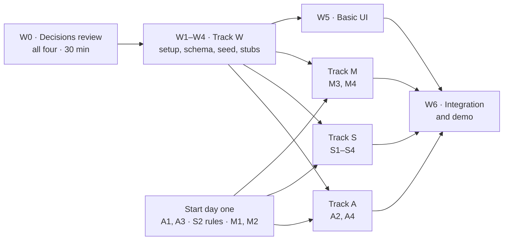

# Sprint tickets

Each ticket is one person, one sitting. Name branches after the ticket and
story (`w2-schema-skeleton`, `s3-us-02-create-session`).

**Sizes:** S ≈ 1–2h · M ≈ 3–4h · L ≈ 5–6h — guesses; re-size after this sprint.
**Status:** ⬜ not started · 🚧 in progress · ✅ done

## Sprint 2 goal

**A Vanderbilt student can sign in, create a study session, and see sessions
in a list — on the deployed app.** (US-01, US-21, US-25, US-02, and the list
half of US-03.)

**Done when:** two people with `@vanderbilt.edu` addresses sign in on the
production URL; one creates a session; the other sees it in the list with the
right seat count.

## Four tracks

**Track W goes first and wires everything.** It builds every table, every
page, and every function the other tracks need — with *stubs* that return
fixture data, so the whole app clicks through end to end before anything real
exists. Each other track then replaces its own stubs with the real thing. After
W4 lands, nobody is waiting on anybody.

| Track | Owner | Builds | Replaces these stubs |
| --- | --- | --- | --- |
| **W · Wiring** | Jack | Schema skeleton, starter data, the stubs themselves, basic UI | — |
| **A · Auth** | | Sign-in, display name, route protection | `src/app/login/*`, `src/app/auth/confirm/route.ts`, `src/lib/supabase/proxy.ts` |
| **S · Sessions API** | | Creating sessions, the session list, course typeahead | `src/app/sessions/actions.ts`, `src/lib/sessions.ts` |
| **M · Google Maps** | | Keys, location picker, location validation | `src/components/LocationPicker.tsx`, `src/lib/places.ts` |

| Track | Day one — no dependencies | Once W2 (schema) and W4 (stubs) land |
| --- | --- | --- |
| W | W0, W1, then W2 → W3 → W4 in order | W5, W6 |
| A | A1, A3 | A2, A4 |
| S | S2's normalization rules and tests | S1, S3, S4 |
| M | M1, then M2 | M3, M4 (stretch) |

### How the stubs work

- **A stub is a typed function or component whose signature W4 fixes.** Its
  body returns fixture data. Its comment names the owning track and ticket.
  Every seam — file, signature, owner, what the stub returns, what the real
  body must do — is listed in [`contracts.md`](./contracts.md).
- **Replace the body, keep the signature.** If a signature has to change, do
  it in a PR that updates every caller, and tell Jack.
- **W2 turns on RLS for every table with no policies**, so nothing is readable
  until a track adds the policies for its tables. That is the safe direction:
  a missing policy fails closed.
- **Migrations:** `npx supabase migration new <name>`, one per PR. Never edit
  one that has merged.

---

## Track W · Wiring, data, basic UI — Jack · do first

#### W0 · Decisions review
**All four · 30 min · first thing**
- [x] Confirm or change the [technical picks](#confirmed-at-w0) and the three unconfirmed readings — all confirmed
- [x] [ADR 0008](./adr/0008-sprint-2-schema-decisions.md) written and Accepted — supersedes ADR 0007's campus-building layer and ADR 0006's closed department list
- [x] `architecture.md` §2, `data/README.md`, and `supabase/README.md` updated to match
- [ ] Worth the same meeting: ratify or overrule ADRs 0001–0003

#### W1 · Finish setup
**S · TASK-03 · 🚧**
- [x] Hosted Supabase project created; Vercel connected, `main` deploys, previews on PRs
- [x] `permissions: contents: read` in `ci.yml`
- [x] Migrations and seed pushed to the hosted project (`supabase db push --include-seed`) — all six tables confirmed through the API; the seed rows are hidden by RLS until policies exist, so their presence is not confirmed
- [x] Same two Supabase values in Vercel for Production, Preview, and Development — done (reported); not checkable from outside while production is behind Vercel's login
- [ ] Supabase URL and publishable key shared with the team through a password manager
- [x] Production URL in the README: https://study-buddy-jdaws.vercel.app
- [ ] **Production loads for a signed-out visitor.** It does not yet: every page redirects to Vercel's login (Deployment Protection), so teammates without Vercel access — and every magic link in A1/A3 — hit a login wall. Turn protection off for production (Vercel → Settings → Deployment Protection); decide separately whether previews stay protected
- [x] **Before M1 creates any keys:** secret scanning and push protection on
- [x] `main` ruleset: PR with one approval required, `verify` check required, no force push, no deletion
- [ ] Add the `db` check to the ruleset's required checks
- [ ] "Automatically delete head branches" on (Settings → General)
- [ ] Dependabot config for npm and GitHub Actions

#### W2 · Schema skeleton
**M · TASK-00 · after W0**
- [x] One migration with every Sprint 2 table: `profiles`, `departments`, `courses`, `locations`, `sessions`, `session_attendees` — columns, keys, and foreign keys per ADR 0008
- [x] Structure only. Rules, triggers, and policies belong to the owning track
- [x] RLS enabled on every table, no policies
- [x] Database test that **every table in `public` has RLS enabled** — a permanent guard, not a placeholder (`tests/db/rls.test.ts`)

#### W3 · Starter data, seed, types
**S · TASK-02 (reduced), TASK-05 · after W2**
- [x] ~10 departments the team takes and a few course numbers each, in `data/`
- [x] Course-number format checked (four digits? letter suffix?) and noted for S2 — four digits plus an optional `W` or `L`; findings in [`data/README.md`](../data/README.md#for-s2-what-the-catalogue-says-about-the-format)
- [x] `supabase/seed.sql` built from `data/` (`npm run db:seed`); `npm run db:reset` loads it
- [x] `npm run db:types` generating `src/lib/database.types.ts`
- [x] CI check that the seed matches `data/` (`verify` job), plus one that the types match the migrations (`db` job)

#### W4 · Stubs and fixtures
**M · after W3 · unblocks A, S, M**
- [x] `src/lib/fixtures.ts` — sessions (one full, one with only the host), departments, courses, locations
- [x] `src/lib/validation.ts` — `signInSchema`, `displayNameSchema`, `createSessionSchema` (end after start, not in the past, capacity ≥ 2), unit tested, including US-02b
- [x] Stubs with final signatures, each returning fixtures:
  - Track S: `createSession()` in `sessions/actions.ts`; `listSessions()`, `listDepartments()`, `searchCourses()` in `src/lib/sessions.ts` — the typeahead reaches `searchCourses()` through `GET /api/courses` ([why](./contracts.md#why-searchcourses-goes-through-a-route-handler))
  - Track M: `<LocationPicker>` (stub: a select of fixture places that submits a `place_id`); `resolvePlace(placeId)` in `src/lib/places.ts`
  - Track A: `signIn()`, `saveDisplayName()`, `signOut()` in `login/actions.ts`; `requireUser()` in `src/lib/supabase/server.ts`
- [x] Every stub's comment names its owning ticket — all listed in [`contracts.md`](./contracts.md)

#### W5 · Basic UI
**L · US-02, US-03 · after W4**
- [x] App shell: header, navigation, sign-in / sign-out link — the header shows "Sign in" until A3 makes a session possible; the sign-out form is component-tested only
- [x] `/sessions`: list and card — course, topic, location, room, time, seats left; "Full" treatment; empty state inviting hosting. Times shown in campus time (`CAMPUS_TIME_ZONE`) — and entered in it too: the form reads its time inputs as Nashville time whatever the device's zone
- [x] `/sessions/new`: department picker with "add a department", course-number typeahead, topic, room, start, end, capacity, `<LocationPicker>`; field errors from `createSessionSchema`
- [x] Mobile first: 44px tap targets, `text-base` inputs (ADR 0004) — checked at 375px in a browser
- [x] Works end to end on fixtures: submitting the form validates and lands on the list (the stub saves nothing, so the new session does not appear until S3)

#### W6 · Integration and demo
**M · end of sprint**
- [ ] Merge tracks as they land; fix any seam mismatches
- [ ] Run the Sprint 2 "done when" on production with two real accounts
- [ ] `docs/test-cases.md` updated with what is genuinely verified
- [ ] Fixtures no longer used by the app kept only where tests need them

---

## Track A · Auth

#### A1 · Hosted auth settings
**S · US-01 · start now**
- [ ] Supabase Auth Site URL = production URL; redirect URLs cover localhost and Vercel previews
- [ ] Magic-link email template points at `/auth/confirm` with `token_hash`
- [ ] Same settings in `supabase/config.toml` for local (local emails appear in Mailpit at http://127.0.0.1:54324)
- [ ] Free-plan email rate limit checked — fine for four testers, matters for a demo

#### A2 · Profile rules
**M · US-01, US-25 · after W2 · 🚧 written, not yet run on a real Supabase database**

`supabase/migrations/20260930210000_profile_rules.sql` and
`tests/db/profiles.test.ts` exist, but Docker was not available when they
were written: the migration has **not** been applied with `supabase db reset`
and `npm run test:db` has **not** run. They were run against PGlite (Postgres
17 in WASM) with a hand-made imitation of Supabase's `auth` schema and roles —
all pass, and nine deliberate breakages of the migration each fail a test —
which shows the SQL is valid and the tests can fail, not that it works on
Supabase. Tick the boxes once `npm run test:db` passes locally or in CI.
- [ ] Trigger rejecting non-`@vanderbilt.edu` signups — also on an email change
- [ ] Trigger creating a `profiles` row on signup
- [ ] `display_name` CHECK matching `displayNameSchema`: 1–50 characters after trimming (`DISPLAY_NAME_MAX_LENGTH` in `src/lib/limits.ts`)
- [ ] RLS: signed-in users read display names; users update only their own
- [x] **Don't copy email into `profiles`.** It already lives in `auth.users`,
      which clients cannot read — that satisfies US-25 without column grants.
      (A column grant *is* used, but for a different reason: so a user can
      update only `display_name`, not `id` or `created_at`.)
- [ ] Database tests: US-01b (direct non-Vanderbilt signup rejected); a user cannot update someone else's profile

#### A3 · Magic-link sign-in
**M · US-01, US-21 · start now · 🚧 written and unit-tested against a mocked Supabase; never run against Supabase Auth**

Scope added by the user: the email carries a **one-time code as well as the
link**, and `/login` takes the code (`verifyCode()`). Reason: Vanderbilt mail
goes through Outlook, whose Safe Links scanning can open links before the
student does; the code also works across devices. **Caveat found while
building it:** link and code are one token, so a scanner that opens the link
spends the code as well — see `supabase/README.md`, "Hosted auth settings".
ADR 0003 still says "magic link" — not edited.
- [ ] `signIn()` validates with `signInSchema` and sends the link — written; no email has actually been sent
- [x] `/login` page with "check your inbox" state and `role="alert"` errors — component-tested (`SignInForm.test.tsx`), plus the code step
- [ ] `/auth/confirm` exchanges the token and redirects **only to same-origin paths** — the redirect rule is unit-tested (`safe-next.test.ts`, `route.test.ts`); the token exchange has not run against Supabase
- [ ] Code sign-in: `verifyCode()` — written and unit-tested; not run against Supabase
- [ ] `signOut()` (US-21) — written and unit-tested; not run against Supabase

#### A4 · Display name and route protection
**M · US-01 · after W2, A3 · 🚧 written and unit-tested against a mocked Supabase; never run against Supabase**
- [ ] First sign-in without a display name goes to a name step (`/login/name`) before anything else; `saveDisplayName()` — written and unit-tested; the update has not run against A2's policies. A nameless student who skips the step can still *browse* `/sessions` (the proxy only checks sign-in); every page or action that calls `requireUser()` — `/sessions/new`, `createSession` — sends them back to it, which is what ADR 0008 rule 1 requires
- [x] Proxy redirects signed-out users away from `/sessions*`, keeping `?next=` — unit-tested (`proxy.test.ts`), including that the redirect keeps refreshed cookies; Supabase mocked
- [ ] `requireUser()` implemented — S3 calls it — written and unit-tested (`server.test.ts`), Supabase mocked

---

## Track S · Sessions API

#### S1 · Session rules
**L · US-02 · after W2**
- [ ] CHECKs: end after start, capacity ≥ 2. No maximums — the host decides
- [ ] `create_session` database function: inserts the session **and** the host
      as an attendee in one transaction; rejects a start in the past —
      allowing the same `START_GRACE_MINUTES` (5) the form allows, or the
      database rejects what the form accepted; requires a display name
- [ ] No client INSERT on `session_attendees` (joining is later, through its own function)
- [ ] RLS: signed-in users read sessions and attendees
- [ ] Database tests for each rejection, and for the host landing on the roster

#### S2 · Departments and courses
**M · US-02 · rules start now, database after W2**
- [ ] Normalization in `src/lib/validation.ts` and matching SQL — `cs`, ` CS `, `C.S.` → `CS`; unit tested
- [ ] Create-on-use: a function returning a course id, creating the department or course if new
- [ ] RLS: signed-in users read and create; no client updates or deletes

#### S3 · Create a session for real
**M · US-02 · after S1, S2**
- [ ] Replace the `createSession()` stub: `requireUser()` → validate → `resolvePlace()` → create-on-use course → `create_session`
- [ ] Database errors mapped through `src/lib/errors.ts`, never raw Postgres text
- [ ] Redirects to the list, where the new session appears

#### S4 · Lists and typeahead for real
**M · US-03 · after S1**
- [ ] `listSessions()`: ended and cancelled sessions excluded, seats left derived from the roster (never stored), soonest first
- [ ] `listDepartments()`; `searchCourses()` ordered by how many sessions used each course
- [ ] `hostDisplayName` on each item needs A2's profiles read policy — until A2 lands, return null (shown as "Deleted user") or coordinate with A2

---

## Track M · Google Maps

#### M1 · Google Cloud and keys
**M · TASK-06 · after W1's push protection**
- [ ] Billing account attached; owner agreed by the team
- [ ] Maps JavaScript API and **Places API (New)** enabled — the legacy Places API lacks `locationRestriction` and `includedPrimaryTypes`
- [ ] Browser key restricted by **HTTP referrer** (production, previews, localhost) and by API
- [ ] Server key restricted **by API only**. IP restriction, as ADR 0007
      suggests, does not work on Vercel — its functions have no fixed outbound
      IP. Keep the key server-side and set a daily quota cap on Places instead
- [ ] Budget alert set; both keys in `.env.local` and Vercel
- [ ] Pricing, and **whether a place's name may be cached**, checked on Google's own pages

#### M2 · Location picker
**L · US-02 · after M1**
- [ ] Replace the `<LocationPicker>` stub, keeping its props
- [ ] Places Autocomplete with `locationRestriction` from `CAMPUS_CENTER` and `CAMPUS_RADIUS_METERS`
- [ ] `includedPrimaryTypes` that surface campus buildings as well as cafés and
      libraries, but not residences — **check Featheringill and Stevenson appear**
- [ ] Session tokens used; submits a `place_id`, never coordinates

#### M3 · Validate and store locations
**M · US-02 · after W2, M1**
- [ ] Replace the `resolvePlace()` stub: look the place up with the server key, check the distance and place type, store it, return a location id
- [ ] Distance check as a pure function, unit tested
- [ ] Location rows written only by the server, the way W0 decided; RLS lets clients read, never write

#### M4 · Map view (stretch)
**M · US-03 · only once M1–M3 are done**
- [ ] List / map toggle on `/sessions`; one marker per session, distinct when full; loads client-side only

---

## Decisions this plan rests on

Product calls, made 2026-09-29:

| Question | Decision |
| --- | --- |
| Display name | Required at first sign-in |
| Capacity and times | Set by the host; only sanity checks, no maximums |
| Host leaving | The host cannot leave — they cancel the session (US-09, later) |
| Chat after a session | Read-only once a week has passed since it ended |
| Deleted accounts | Anonymised: messages kept as "Deleted user", upcoming hosted sessions cancelled |
| Study requests | The poster sets a time range; the request expires at its end |
| Locations | No curated building list — everything comes from Google Places |
| Departments and courses | A handful seeded; users add the rest, departments included |

The last two reverse parts of ADRs 0006 and 0007. Normalization and usage
ranking are now the only defence against `CS` / `C.S.` / `COMPSCI` duplicates —
an accepted risk. All of this is recorded in
[ADR 0008](./adr/0008-sprint-2-schema-decisions.md).

#### Confirmed at W0

Approved 2026-09-29 and recorded in ADR 0008:

- Seats left derived from the roster, never a stored counter
- Authorization in RLS on every table; server checks exist for error messages
- Joining (later) through a database function holding a row lock
- Location rows written only by the server — which brings the Supabase secret key into the app as a server-only variable
- One `locations` table of Places venues, no building/venue split
- The session stores a host-editable location label; `locations` stores no name — the default until M1 finds out what Google allows
- The server Maps key is restricted by API and a daily quota cap, not IP
- Email is never copied into `profiles`
- The three readings of the product calls: chat stays writable for the week; "set by the host" still allows sanity checks; users may add departments

---

## Later sprints

IDs are assigned when a ticket is scheduled.

| Work | Stories | Notes |
| --- | --- | --- |
| Atomic join | US-04, US-07 | Row-locked join function; the US-07b concurrency test replaces `tests/db/harness.test.ts` |
| Join and leave | US-04, US-07, US-08 | Through the join function only; live roster; the host cancels rather than leaves |
| Host edit and cancel | US-09 | Cancelling is how a host leaves |
| Session detail page | US-04, US-05, US-23 | Roster, join button, chat |
| Messages and chat | US-05 | Attendees only; read-only a week after the session ends, enforced in RLS; Realtime; US-05b test |
| Study requests | US-16 | Poster-set time range. **P0 in the backlog** — deferred, not deprioritised |
| Filters | US-06, US-12 | Course filter; the campus-zone filter needs rethinking without a building list |
| Account deletion | US-24 | The anonymising behaviour decided above |
| Accessibility pass | TASK-04 | Keyboard and screen reader over the core flows |
| Safety group | US-18, US-22, US-23 | Land all three before any public launch |

**Dropped:** curating campus buildings (TASK-01) and asking VU for campus GIS
data (TASK-07) — Google Places covers every location.

## Rules

- Run the pre-PR checks in `CLAUDE.md`.
- If you used AI, add a row to `docs/ai-usage-log.md` **in the same PR**.
- When a ticket genuinely verifies an acceptance criterion, update `docs/test-cases.md`.
