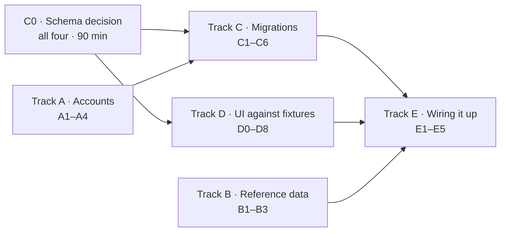

# Sprint tickets

Smaller than the user stories in [`backlog.md`](./backlog.md) — each of these is
one person, one sitting. Story IDs carry through so traceability survives.

**Sizes:** S ≈ 1–2h · M ≈ 3–4h · L ≈ 5–6h

## How this is structured

The schema blocks most feature work, so the tracks below are arranged so that
only **one** of them actually waits on it. Tracks A, B, and D can start
immediately and in parallel.

**Do C0 first.** It is a meeting, not a ticket, and everything in Track C is
blocked until it happens. Bring `docs/architecture.md` §2 — the proposed class
models are there to be argued with.

---

## C0 · Schema decision meeting

**All four · 90 minutes · blocks Track C**

Decide and write down:

- Final table list and relationships
- Seat count: derived from the roster, or a stored counter
- How concurrent joins stay correct
- Authorization: RLS policies, application checks, or both
- Locations: single table with a `kind` discriminator, or table-per-subclass

**Done when:** `docs/architecture.md` §2 is updated from "Proposed" to
"Agreed", and Track C tickets have concrete table names.

---

## Track A · Accounts and infrastructure

No dependencies. Somebody should pick these up on day one — Track C cannot be
*applied* without A1.

### T-A1 · Create the Supabase project
**S · blocks C1–C6, E1–E5**
- [ ] Project created, region chosen
- [ ] URL and anon key added to every member's `.env.local`
- [ ] Same values added to Vercel environment variables
- [ ] Credentials shared through something that is not Slack or email

### T-A2 · Google Cloud project and API keys
**M · blocks D5, D6 · see ADR 0007**
- [ ] Project created, billing account attached, owner agreed by the team
- [ ] Maps JavaScript API and Places API enabled
- [ ] Browser key created and **restricted by HTTP referrer** (Vercel domain + localhost)
- [ ] Server key created and **restricted by IP**
- [ ] Both added to `.env.local` and Vercel
- [ ] Budget alert set

> Do not commit either key. Do T-A4 first if you want a safety net.

### T-A3 · Deploy the scaffold to Vercel
**S**
- [ ] Repo connected, `main` deploys automatically
- [ ] Preview deployments enabled for pull requests
- [ ] Deployed URL in the README

### T-A4 · Repository protections
**S**
- [ ] Secret scanning and push protection enabled
- [ ] `main` ruleset: PR required, `verify` check required, no force push, no deletion
- [ ] Dependabot config for npm and GitHub Actions
- [ ] `permissions: contents: read` added to `ci.yml`

---

## Track B · Reference data

No dependencies. Pure data work — a good ticket for whoever wants to start
without touching the stack.

### T-B1 · Compile the department list
**M · TASK-02 · ADR 0006**
- [ ] `data/departments.json` with every subject code and full name
- [ ] Codes uppercase and trimmed
- [ ] Source noted in the file so it can be refreshed later

### T-B2 · Curate campus buildings
**M · TASK-01 · ADR 0007**
- [ ] `data/buildings.json`, ~25 core academic buildings
- [ ] Coordinates **checked against a real map**, not estimated
- [ ] Names match what students actually say
- [ ] `verified: true` only on rows genuinely checked

### T-B3 · Ask VU about campus GIS data
**S · TASK-07**
- [ ] Email Facilities or VU IT asking whether campus building GIS data is available
- [ ] Reply recorded in the ticket

> Non-blocking. Send it and carry on with T-B2 — do not wait for an answer.

---

## Track C · Database

Blocked on C0. C1, C2, and C3 are independent of each other and can run in
parallel across three people; C4 needs all three.

### T-C1 · Profiles, signup trigger, RLS
**M · US-01, US-25**
- [ ] `profiles` table
- [ ] Trigger rejecting non-`@vanderbilt.edu` signups
- [ ] Trigger creating a profile row on signup
- [ ] RLS enabled with read and self-update policies
- [ ] Email address not readable by other users

### T-C2 · Departments and courses
**M · US-02, ADR 0006**
- [ ] `departments` and `courses` tables, unique on (department, number)
- [ ] Normalization applied on write
- [ ] `merged_into` column present
- [ ] RLS: any signed-in user may read; course creation allowed, department creation not

### T-C3 · Locations
**M · US-02, ADR 0007**
- [ ] `locations` table per the C0 decision
- [ ] Campus radius validation available server-side
- [ ] RLS: read for signed-in users

### T-C4 · Sessions, attendees, messages
**L · US-02, US-04, US-05 · depends on C1, C2, C3**
- [ ] Three tables with foreign keys and CHECK constraints
- [ ] Attendee composite primary key
- [ ] RLS: sessions readable by all; messages readable only by attendees
- [ ] **No INSERT permission on attendees** — that is C5's job

### T-C5 · Atomic join
**M · US-04, US-07 · depends on C4**
- [ ] Join function holding a row lock across the capacity check and insert
- [ ] Distinct error codes for full, cancelled, ended, not-signed-in
- [ ] Host added to their own roster on session creation
- [ ] **Concurrency test from `test-cases.md` US-07b, passing**

> The test is the deliverable here, not the function. Two connections, one
> seat, exactly one winner.

### T-C6 · Generated types and seed loading
**S · depends on C1–C4, B1, B2**
- [ ] TypeScript types generated from the schema, replacing hand-written ones
- [ ] Seed script loading `data/*.json`
- [ ] `npm run db:reset` documented in the README

---

## Track D · Interface

Blocked only on C0 (so the fixture shapes are right), **not** on the database.
This is where two people can work productively while the schema lands.

### T-D0 · Typed fixtures
**S · unblocks the rest of Track D**
- [ ] Fixture data matching the agreed model — a handful of sessions, courses, locations, profiles
- [ ] Exported from one module so every component imports the same shapes

### T-D1 · App shell
**M · ADR 0004**
- [ ] Header with navigation and a sign-in/out affordance
- [ ] Mobile-first container, 44px tap targets
- [ ] Loading and error states that are not blank screens

### T-D2 · Sign-in screen
**M · US-01**
- [ ] Email field, inline validation, `@vanderbilt.edu` message
- [ ] "Check your inbox" confirmation state
- [ ] No backend — form submission stubbed

### T-D3 · Session list and card
**M · US-03 · depends on D0**
- [ ] Card showing course, topic, location, time, seats left
- [ ] Distinct "Full" treatment
- [ ] Empty state that invites hosting (US-16)

### T-D4 · Filters
**M · US-06, US-12 · depends on D3**
- [ ] Course and campus-zone filters
- [ ] Clearing restores the full list
- [ ] Filter state does not reset on view toggle

### T-D5 · Map view
**M · US-03 · depends on A2, D0**
- [ ] Google Map centred on campus
- [ ] One marker per fixture session, distinct when full
- [ ] Info window with a link through to the session
- [ ] Loads client-side only

### T-D6 · Location picker
**L · US-02 · depends on A2**
- [ ] Campus building selector
- [ ] Places autocomplete using **`locationRestriction`**, not `locationBias`
- [ ] `includedPrimaryTypes` set so residences are excluded
- [ ] Session tokens used

### T-D7 · Create-session form
**M · US-02 · depends on D6**
- [ ] Department picker plus course-number input with typeahead
- [ ] "Nobody's studied this yet — create it?" for unseen numbers
- [ ] Time range, capacity, notes
- [ ] Client-side validation with field-level errors

### T-D8 · Session detail layout
**M · US-04, US-05, US-23 · depends on D0**
- [ ] Session header, roster list, join/leave button
- [ ] Chat transcript and composer
- [ ] Non-attendee sees a prompt to join rather than the transcript
- [ ] `role="log"` and `aria-live="polite"` on the transcript

---

## Track E · Wiring

Each ticket replaces fixtures with real data and closes out a user story.
Depends on the matching C and D tickets.

### T-E1 · Authentication end to end
**L · US-01 · depends on C1, D2, A1**
- [ ] Sign-in link sends, lands, and creates a session
- [ ] Proxy protects private routes and refreshes the token
- [ ] Sign-out works (US-21)
- [ ] Non-Vanderbilt address rejected at the database

### T-E2 · Create a session
**M · US-02 · depends on C2, C3, C4, D7**
- [ ] Form writes a real session and redirects to it
- [ ] New course numbers persist and appear as suggestions afterwards
- [ ] **Submitted coordinates re-validated server-side** against the campus radius

### T-E3 · Browse real sessions
**M · US-03, US-06, US-12 · depends on C4, D3, D4, D5**
- [ ] List and map read live data
- [ ] Ended and cancelled sessions excluded
- [ ] Filters work against real rows

### T-E4 · Join and leave
**M · US-04, US-07, US-08 · depends on C5, D8**
- [ ] Join goes through the database function, never a direct insert
- [ ] Full sessions rejected with a clear message
- [ ] Roster updates live for everyone watching

### T-E5 · Session chat
**L · US-05 · depends on C4, D8**
- [ ] Messages persist and appear for all attendees
- [ ] Realtime subscription with de-duplication by message id
- [ ] Non-attendees receive nothing, verified by querying directly

---

## Suggested split

One plausible allocation. Adjust to who wants to learn what.

| Person | Day one | Then |
| --- | --- | --- |
| 1 | T-A1, T-A3, T-A4 | T-C1, T-E1 |
| 2 | T-A2, T-B3 | T-D6, T-D5, T-E3 |
| 3 | T-B1, T-B2 | T-C2, T-C3, T-E2 |
| 4 | T-D0, T-D1 | T-D3, T-D4, T-D8 |

Then C4 → C5 → E4/E5 together, since those are the pieces where a mistake is
expensive and a second pair of eyes is worth the time.

## Two rules for these tickets

**Update `docs/ai-usage-log.md` in the same pull request** if you used AI on the
work. It is a graded artifact and reconstructing it later produces something
useless.

**Update `docs/test-cases.md`** when a ticket makes an acceptance criterion
genuinely verified. That file is the honest record of coverage, and it is only
useful if it stays honest.
