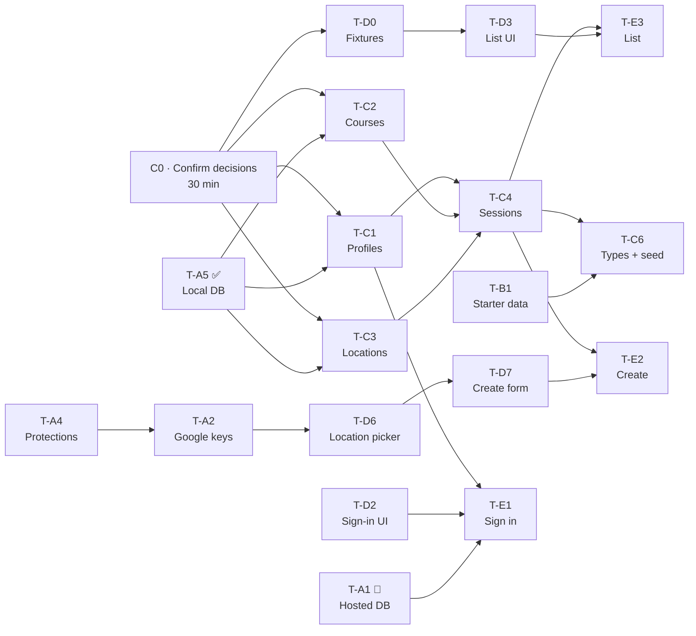

# Sprint tickets

Smaller than the user stories in [`backlog.md`](./backlog.md) — each of these is
one person, one sitting. Story and task IDs carry through so traceability
survives: name the branch after the first ID on the ticket
(`us-02-create-session`, `task-03-supabase-project`).

**Sizes:** S ≈ 1–2h · M ≈ 3–4h · L ≈ 5–6h. These are guesses with no
velocity behind them — re-size after this sprint.

Status: ⬜ not started · 🚧 in progress · ✅ done

## Sprint 2 goal

**A Vanderbilt student can sign in, create a study session, and see sessions
in a list — on the deployed app.**

That is US-01 (with US-21 sign-out and US-25 hidden email), US-02, and the list
half of US-03. Everything else — the map, filters, joining, chat, study
requests, the session detail page — is [later](#later-sprints).

**Done when:** two people with `@vanderbilt.edu` addresses sign in on the
production URL; one creates a session; the other sees it in the list with the
right seat count.

| Area | Tickets | Status |
| --- | --- | --- |
| Foundations | C0, T-A1, T-A3, T-A4, T-A5, T-B1, T-C6, T-D0, T-D1 | T-A5 ✅ · T-A1 🚧 · T-A3 🚧 · rest ⬜ |
| Sign in | T-C1, T-D2, T-E1 | ⬜ |
| Create a session | T-A2, T-C2, T-C3, T-C4, T-D6, T-D7, T-E2 | ⬜ |
| Session list | T-D3, T-E3 | ⬜ |

T-D1 (app shell) and T-D2 (sign-in UI) have no dependencies and can start
today, as can T-A4 and T-B1.

---

## C0 · Decisions

**Status:** product calls decided 2026-09-29 · technical picks awaiting team
confirmation · **blocks Track C and T-D0**

C0 was a 90-minute design meeting. Most of it is now decided, so it becomes a
**30-minute review**: the team reads the decisions below, changes what it
disagrees with, and records the result.

### Decided (product)

| Question | Decision | Lands in |
| --- | --- | --- |
| Display name | **Required at first sign-in**, before anything else | T-C1, T-D2, T-E1 |
| Capacity and time limits | **Set by the host.** The app enforces only sanity: end after start, start not in the past, capacity at least 2 (the host is one of them). No maximums. | T-C4, T-D7 |
| Can the host leave? | **No — the host cancels the session instead** (US-09, later sprint) | T-C4 (status column now) |
| Chat after a session ends | **Stays open for a week after the session ends, then read-only** | T-C8 (later) |
| Deleted accounts | **Anonymise:** messages survive, shown as "Deleted user"; personal data removed; the user's upcoming hosted sessions cancelled | T-C1 (schema now; deletion UI is US-24, later) |
| Study requests | **The poster sets a time range; the request expires when it ends** | T-C7 (later) |
| Locations | **No curated building list.** Every location, campus buildings included, comes from Google Places | T-C3, T-D6; T-B2 and T-B3 dropped |
| Departments and courses | **Seed only a handful. Users add the rest — departments as well as course numbers** | T-B1, T-C2 |

The last two reverse parts of accepted ADRs: ADR 0007's curated campus layer,
and ADR 0006's closed department list — which was the thing keeping course
entry from degenerating into free text. Normalization and usage ranking
(ADR 0006) are now the only defence against `CS` / `C.S.` / `COMPSCI`
duplicates. That is an accepted risk, not an oversight.

### To confirm (technical recommendations)

- **Seat count derived from the roster**, never a stored counter.
- **Authorization in RLS**, on every table, deny by default. Server checks
  exist only to produce good error messages.
- **Joins go through a database function holding a row lock** (T-C5, later —
  but confirm the approach now).
- **Venue rows are written only by the server**, after it looks the place up
  with Google and checks the radius and place type. That brings the Supabase
  secret key into the app as a server-only variable — the team should accept
  that knowingly.
- **One `locations` table of Places venues.** With no curated buildings, the
  `kind` discriminator and the class hierarchy in `architecture.md` §2.3 go.
- **Venue name: store it, or have the host type a label?** Depends on whether
  Google's terms allow caching the name — check during T-A2.

### Done when

- [ ] Team has reviewed the above; changes recorded
- [ ] ADR 0008 written and Accepted, superseding the campus-building half of
      ADR 0007 and the closed department list in ADR 0006
- [ ] `architecture.md` §2 updated (Location without `CampusBuilding`,
      `StudyRequest` with a time range, the chat read-only rule) and marked "Agreed"
- [ ] `data/README.md` and `supabase/README.md` updated to match
- [ ] Worth doing in the same meeting: ratify or overrule ADRs 0001–0003

---

## Sprint 2 tickets

### Foundations

#### T-A1 · Hosted Supabase project
**S · TASK-03 · 🚧 · blocks E1–E3 on the deployed app**
- [x] Project created, region chosen
- [x] URL and publishable key in the creator's `.env.local`
- [ ] Shared with the other three through a password manager, not Slack or email
- [ ] Same two values in Vercel for Production, Preview, and Development —
      **every page returns 500 without them**, and adding them later needs a redeploy
- [ ] Secret key and database password in the password manager only

#### T-A3 · Deploy to Vercel
**S · 🚧**
- [x] Repo connected, `main` deploys to production automatically
- [x] Preview deployments on pull requests
- [ ] Production URL loads for a signed-out visitor. Deployment Protection is
      currently on, so deployment URLs redirect to a Vercel login — decide
      whether previews stay protected
- [ ] Production URL in the README

#### T-A4 · Repository protections
**S · blocks A2**
- [ ] Secret scanning and push protection enabled
- [ ] `main` ruleset: PR required, `verify` and `db` checks required, no force push, no deletion
- [ ] "Automatically delete head branches" on — without it a stacked PR can
      merge into a dead branch, which is what happened to #2
- [ ] Dependabot config for npm and GitHub Actions
- [x] `permissions: contents: read` in `ci.yml`

#### T-A5 · Local database and database test harness ✅
**M · TASK-03 · landed in #4**
- [x] `supabase init`; `npm run db:start` / `db:reset` / `db:status` documented
- [x] Vitest + two `pg` clients (reasoning in `test-cases.md`); harness test passing
- [x] Database tests run in CI (the `db` job)

#### T-B1 · Starter departments and courses
**S · TASK-02 (reduced)**
- [ ] ~10 departments the team actually takes, in `data/departments.json`, codes uppercase
- [ ] A few course numbers per department, so the typeahead is not empty on day one
- [ ] Course-number format checked (four digits? letter suffixes?) — T-C2's rule depends on it

> Not the catalog. Users add the rest.

#### T-C6 · Generated types and seed
**S · TASK-05 · depends on C1–C4, B1**
- [ ] TypeScript types generated from the schema
- [ ] `supabase/seed.sql` loading B1's rows; `npm run db:reset` loads it
- [ ] Seed-freshness check in CI — `CLAUDE.md` and ADR 0005 describe one; it does not exist yet

#### T-D0 · Typed fixtures
**S · depends on C0**
- [ ] A handful of sessions, courses, departments, locations, and profiles
      matching the agreed model — including a full session and one with only the host
- [ ] Exported from one module so every component imports the same shapes

#### T-D1 · App shell
**M · ADR 0004**
- [ ] Header with navigation and a sign-in/out affordance
- [ ] Mobile-first container, 44px tap targets
- [ ] Loading and error states that are not blank screens

### Sign in

#### T-C1 · Profiles, signup trigger, RLS
**M · US-01, US-25 · schema for US-24**
- [ ] `profiles` table. `display_name` is empty at signup (the trigger runs
      before the user has typed one) but **required before creating a
      session — enforced in the database**, not only the UI
- [ ] Trigger rejecting non-`@vanderbilt.edu` signups
- [ ] Trigger creating a profile row on signup
- [ ] RLS: signed-in users read profiles; users update only their own
- [ ] Email not readable by other users — a column-scoped `GRANT`, because RLS cannot hide a column
- [ ] Deletion designed now: messages and past sessions survive, attributed
      to "Deleted user"; personal data removed; upcoming hosted sessions
      cancelled. Pick set-null foreign keys or anonymise-in-place and say why
      in the migration
- [ ] Database tests for US-01b (direct non-Vanderbilt signup rejected) and US-11b (another user's email denied)

#### T-D2 · Sign-in screen
**M · US-01**
- [ ] Email field with the shared `@vanderbilt.edu` rule from `src/lib/validation.ts`, unit tested
- [ ] "Check your inbox" confirmation state
- [ ] Display-name step for first sign-in
- [ ] No backend — submission stubbed

#### T-E1 · Sign in end to end
**L · US-01, US-21 · depends on C1, D2, A1**
- [ ] Hosted Supabase Auth configured: Site URL is the production URL; redirect URLs cover localhost and Vercel previews
- [ ] Magic-link email template points at `/auth/confirm` with `token_hash`
- [ ] Link sends, lands, and signs the user in; `/auth/confirm` redirects only to same-origin paths
- [ ] First sign-in asks for a display name before anything else
- [ ] Proxy redirects signed-out users away from private routes, keeping `?next=`
- [ ] Sign-out (US-21)
- [ ] Non-Vanderbilt address rejected at the database

> Supabase's built-in email sender is rate-limited on the free plan (ADR 0003).
> Fine for four testers; check the current limit before a demo.

### Create a session

#### T-A2 · Google Cloud project and API keys
**M · TASK-06 · ADR 0007 · depends on A4 · blocks D6**
- [ ] Project created, billing attached, owner agreed by the team
- [ ] Maps JavaScript API and **Places API (New)** enabled — `locationRestriction` and `includedPrimaryTypes` do not exist in the legacy Places API
- [ ] Browser key **restricted by HTTP referrer** and API; server key **restricted by IP**
- [ ] Both in `.env.local` and Vercel; budget alert set
- [ ] Pricing, free tier, and **whether a place's name may be cached** checked on Google's own pages — the last one settles a C0 question

#### T-C2 · Departments and courses
**M · US-02 · ADR 0006 as amended by C0**
- [ ] `departments` and `courses` tables; courses unique on (department, number)
- [ ] Normalization on write for both — `cs`, ` CS `, `C.S.` → `CS`
- [ ] `merged_into` on courses (and departments, now they are user-created)
- [ ] RLS: signed-in users read and create both; no client updates or deletes
- [ ] Matching rules in `src/lib/validation.ts`, unit tested

#### T-C3 · Locations
**M · US-02 · ADR 0007 as amended by C0**
- [ ] `locations` table keyed on Google `place_id`, with the coordinates the server validated
- [ ] Name or host label, per the C0 / T-A2 answer
- [ ] Radius check server-side, reading the one constant in `src/lib/env.ts`
- [ ] RLS: signed-in users read; **no client insert** — the server writes venue rows

#### T-C4 · Sessions and attendees
**L · US-02 · depends on C1, C2, C3**
- [ ] `sessions`: host, course, location, room, topic, start, end, capacity, status (open / cancelled)
- [ ] Sanity constraints only: end after start, capacity ≥ 2, start not in the
      past on insert (a CHECK cannot rely on `now()` — use a trigger or the
      create function). No maximums; the host decides
- [ ] Creating requires a display name (T-C1)
- [ ] `session_attendees` with a composite primary key; the host is added in
      the same transaction as the session
- [ ] No client INSERT on attendees — joining is T-C5, later
- [ ] RLS: signed-in users read sessions; users create sessions only as themselves
- [ ] Seats left available to the list without a stored counter
- [ ] Constraints mirrored in `src/lib/validation.ts`

#### T-D6 · Location picker
**L · US-02 · depends on A2**
- [ ] Google Places autocomplete only — no building list
- [ ] `locationRestriction` built from `CAMPUS_CENTER` and `CAMPUS_RADIUS_METERS`, not `locationBias`
- [ ] `includedPrimaryTypes` that surface campus buildings as well as cafés and
      libraries — **check real Vanderbilt buildings appear** (Featheringill,
      Stevenson) before locking the list — while excluding residences
- [ ] Session tokens used
- [ ] Returns a `place_id`, never coordinates — the server resolves those

#### T-D7 · Create-session form
**M · US-02 · depends on D6**
- [ ] Department picker with "add a department"; course-number typeahead with "create it?" for unseen numbers
- [ ] Topic, room, time range, capacity
- [ ] Field-level errors from the shared schema in `src/lib/validation.ts`, with unit tests for US-02b

#### T-E2 · Create a session
**M · US-02 · depends on C2, C3, C4, D7**
- [ ] Form writes a real session with the host on the roster, then redirects to the list
- [ ] New departments and course numbers persist and appear as suggestions afterwards
- [ ] **Location resolved server-side** from the `place_id` with the server key,
      then checked against the radius. Never trust coordinates sent by the client

### Session list

#### T-D3 · Session list and card
**M · US-03 · depends on D0**
- [ ] Card showing course, topic, location, room, time, seats left
- [ ] Distinct "Full" treatment
- [ ] Empty state that invites hosting

#### T-E3 · Session list on real data
**M · US-03 · depends on C4, D3**
- [ ] Server-rendered list of live sessions
- [ ] Ended and cancelled sessions excluded
- [ ] Seat counts correct, including the host

---

## Later sprints

Kept so the thinking is not lost. Re-check each against C0 before starting.

| Ticket | Size | Stories | What |
| --- | --- | --- | --- |
| T-C5 · Atomic join | M | US-04, US-07 | Join function holding a row lock; distinct error codes mapped in `src/lib/errors.ts`; **US-07b concurrency test** — replaces `tests/db/harness.test.ts` |
| T-C7 · Study requests | S | US-16 | Table with a poster-set time range; expired requests excluded from reads; users create and delete only their own |
| T-C8 · Messages | M | US-05 | Table; RLS readable by attendees only; **writable until a week after the session ends, then read-only — enforced in RLS**; in the Realtime publication; US-05b test |
| T-D4 · Filters | M | US-06, US-12 | Course filter. The campus-zone filter came from the building list — rethink it (distance from campus?) |
| T-D5 · Map view | M | US-03 | Google Map, one marker per session, distinct when full, client-only |
| T-D8 · Session detail | M | US-04, US-05, US-23 | Header, roster, join/leave, chat with `role="log"`; non-attendees see a prompt to join |
| T-D9 · Study request form | M | US-16 | Course, time range; "start a session for this" pre-fills the create form |
| T-E4 · Join and leave | M | US-04, US-07, US-08 | Through the join function only; live roster; host cannot leave, only cancel |
| T-E5 · Session chat | L | US-05 | Realtime with de-duplication; read-only state shown after the week; non-attendees receive nothing |
| T-E6 · Study requests | S | US-16 | End to end, expiring on schedule |

**US-16 is P0 in the backlog.** Deferring it past Sprint 2 is a scheduling
choice, not a priority change — it still has to land before release.

### Dropped

- **T-B2 · Curate campus buildings** (TASK-01) — replaced by Google Places for
  every location (C0).
- **T-B3 · Ask VU about campus GIS data** (TASK-07) — only mattered for the
  curated building layer.

### Not ticketed yet

- **US-09** (edit and cancel) — cancelling is how a host leaves, so it matters
  as soon as joining exists.
- **TASK-04**, the keyboard and screen-reader pass.
- **The safety group** (US-18, US-22, US-23) — the backlog says to land all
  three before any public launch.

## Suggested Sprint 2 split

One plausible allocation, roughly 12–16 hours each by the size guesses above.
Adjust to who wants to learn what.

| Person | Owns | Tickets |
| --- | --- | --- |
| 1 | Sign in | T-A4, T-A1, T-A3, T-C1, T-D2, T-E1 |
| 2 | Locations and list | T-A2, T-C3, T-D6, T-E3 |
| 3 | Session data | T-B1, T-C2, T-C4, T-C6, T-E2 |
| 4 | Interface | T-D0, T-D1, T-D3, T-D7 |

T-C4 and T-E2 are where a mistake is expensive — worth a second reviewer.

## Rules for these tickets

**Run the pre-PR checks** in `CLAUDE.md` before opening the pull request.

**Update `docs/ai-usage-log.md` in the same pull request** if you used AI on the
work. It is a graded artifact and reconstructing it later produces something
useless.

**Update `docs/test-cases.md`** when a ticket makes an acceptance criterion
genuinely verified. That file is the honest record of coverage, and it is only
useful if it stays honest.
